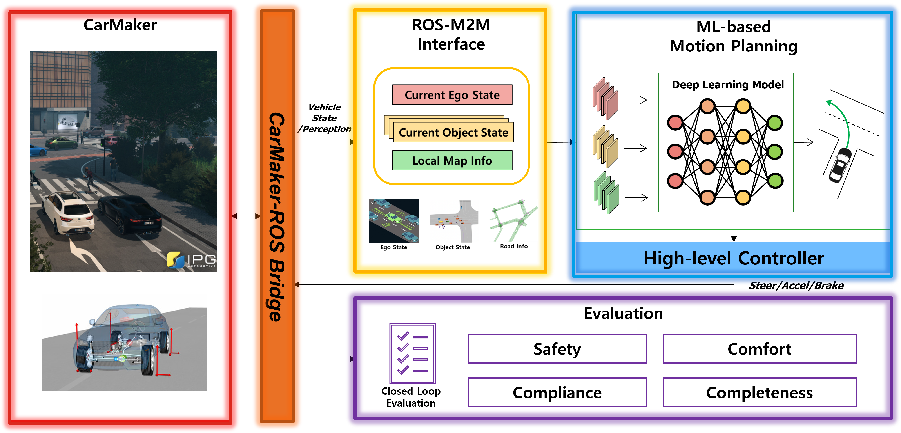

# CarMaker-based Autonomous Driving Validation Framework

## Project Resources

| Resource | Link |
|----------|------|
| Presentation Video | [YouTube](https://youtu.be/K0SmEDuolcY) |
| Demo Video | [YouTube](https://youtu.be/K0SmEDuolcY) |
| Presentation Slides | [Google Slides](https://docs.google.com/presentation/d/138xGUq43BR-bDI26JRtEReK5kgTf6fG8/edit?usp=drive_link&ouid=108242632374087373637&rtpof=true&sd=true) |
| Report | [Google Drive](https://drive.google.com/file/d/1JDw7noqTI9lnimkm0i9857rL1dqP2imS/view?usp=drive_link) |
| Dataset | [nuPlan Dataset Setup Guide](https://nuplan-devkit.readthedocs.io/en/latest/dataset_setup.html) |

## Repository Note

This repository contains only the code implemented by the author (Seungji Ryu) as part of this project. Pre-existing internal lab modules (CarMaker bridge, motion prediction, map loader, behavior planner, control stack, evaluation stack, and other ROS packages) are distributed as pre-built **binary packages** in the `install/` directory and are not included as source code.

The source code provided here covers:
- **`src/mid2mid_planning_diffusion/`** — M2M planning ROS node and Diffusion Planner integration (including classifier guidance extensions)
- **`src/mid2mid_planning_pluto/`** — M2M planning ROS node and Pluto model integration
- **`config/`** — all runtime configuration files
- **`launch/`** — ROS launch files
- **`nuplan-devkit/`** — upstream nuPlan SDK (MIT licensed, included for reference)

---

## Overview

This repository presents an advanced validation framework for **deep learning-based mid-to-mid (M2M) path planning models** in autonomous driving, with the primary objective of reducing the **"Sim-to-Real" gap** through real-time closed-loop testing.

The framework integrates two deep learning-based M2M planning models for comparative closed-loop evaluation:

- **Diffusion Planner** — a diffusion-based trajectory generation model built on a Diffusion Transformer (DiT). The model iteratively denoises trajectory samples (VP-SDE + DPM-Solver) to produce diverse, multimodal trajectories. It natively supports **classifier guidance**: collision avoidance and lane keeping constraints can be injected at inference time **without retraining**.
- **Pluto** — a transformer-based multi-modal trajectory planner originally developed for the nuPlan benchmark. It encodes surrounding agents, map polygons, and route reference lines via cross-attention, and decodes multiple trajectory modes jointly. The framework adapts Pluto to run directly from the CarMaker `PlanningSpace` message without any nuPlan dependencies.

The active model is selected at launch time via the `--model` flag and requires no code changes.

### Objective

- **Real-time closed-loop testing** for autonomous driving systems
- **Reduce the "Sim-to-Real" gap** of M2M models by developing an advanced validation framework
- Validate ML-based planning models under realistic operational conditions with proper system integration

### Method

The framework achieves its objectives through three key methodologies:

1. **CarMaker-ROS Interface Development**
   - Developed necessary interfaces including CarMaker-ROS bridge for M2M model input
   - Integrated high-fidelity vehicle dynamics simulation with ROS-based autonomous driving stack
   - Enabled seamless data flow between simulator and planning modules with realistic timing constraints

2. **M2M Model Inference Environment**
   - Established M2M model inference environment to be tested within the ROS framework
   - Integrated **Diffusion Planner** as the baseline and **Pluto** as the second model for comparative evaluation
   - Supports modular **classifier guidance** (collision, lane keeping) for Diffusion Planner, configurable via YAML without code changes
   - Implemented real-time constraints matching production systems (100ms planning cycle)
   - Deployed complete perception-planning-control pipeline with actual communication latencies
   - Models are interchangeable at launch time via a single `--model` flag with no code modifications

3. **Test Scenario Design and Evaluation**
   - Designed and evaluated test scenarios to validate M2M model performance
   - Implemented comprehensive evaluation metrics including path tracking accuracy, comfort, and safety
   - Enabled closed-loop testing in CarMaker environments with realistic traffic scenarios

### Key Contributions

This framework bridges the gap between offline imitation learning model development and real-world deployment by providing:

- **High-fidelity simulation** with CarMaker's detailed vehicle dynamics (suspension, tire models, powertrain)
- **Real-time distributed architecture** using ROS with realistic inter-module communication constraints
- **Complete autonomous driving stack** including perception, planning, and MPC-based control
- **Multi-model support**: Diffusion Planner and Pluto are interchangeable via `--model` flag at launch; same ROS topics and period
- **Flexible guidance at inference time** via classifier guidance (Diffusion Planner), enabling constraint enforcement without model retraining
- **Quantitative validation** beyond offline dataset evaluation, testing real-time performance, system integration, and closed-loop stability

## System Architecture



## Integrated Planning Models

### Diffusion Planner

**Diffusion-Based Planning for Autonomous Driving with Flexible Guidance**

<p align="left">
<a href='https://arxiv.org/abs/2501.15564'>
    
</a>
<a href='https://github.com/ZhengYinan-AIR/Diffusion-Planner'>
    
</a>
</p>

The Diffusion Planner generates ego and neighbor agent trajectories jointly using a **Diffusion Transformer (DiT)** with a denoising diffusion process (VP-SDE + DPM-Solver). The model encodes surrounding context (agents, lanes, static objects) via MLP-Mixer and self-attention, then generates multi-agent future trajectories through iterative denoising.

#### Classifier Guidance

A key advantage of diffusion-based planning is the ability to incorporate **classifier guidance** at inference time without retraining the model. By adding gradient-based guidance functions during the denoising process, additional safety and driving constraints can be enforced:

- **Collision Guidance**: Penalizes trajectories that result in collisions with neighboring agents, using signed distance fields between vehicle bounding boxes.
- **Lane Keeping Guidance (Drivable Area)**: Penalizes trajectories that deviate from the lane center or cross lane boundaries, using lateral offset from the nearest route centerline.

These guidance functions are modular and can be independently enabled/disabled via `config/planning_ml.yaml`.

### Pluto

**Pluto: Pushing the Limit of Imitation Learning-based Planning for Autonomous Driving**

<p align="left">
<a href='https://arxiv.org/abs/2404.14327'>
    
</a>
<a href='https://github.com/jchengai/pluto'>
    
</a>
</p>

Pluto is a transformer-based multi-modal trajectory planner originally developed for the nuPlan benchmark. It encodes surrounding agents (via Neighborhood Attention), map polygons, and route reference lines through cross-attention, and jointly decodes multiple trajectory mode candidates. The framework adapts Pluto into a standalone ROS node (`src/mid2mid_planning_pluto/`) that operates directly from the CarMaker `PlanningSpace` message **without any nuPlan runtime dependencies**.

## Prerequisites

### System Requirements

- **OS**: Ubuntu 20.04 LTS
- **Python**: 3.9
- **ROS**: ROS Noetic
- **CMake**: 3.15 or higher
- **CUDA**: 11.8 (for ML inference)
- **CarMaker**: Version compatible with ROS Noetic

### Required Libraries and Dependencies

#### Core Dependencies
- **HPIPM**: High-Performance Interior Point Method solver (backend for acados)
- **blasfeo**: Linear algebra routines for HPIPM
- **Lanelet2**: HD map representation and routing

#### Python Packages (Diffusion Planner)
- PyTorch 2.0.0 (with CUDA 11.8 support)
- pytorch-lightning 2.0.1
- timm 1.0.10 (PyTorch Image Models)
- mmengine
- scipy 1.13.1
- rospkg, netifaces
- NumPy

#### Python Packages (Pluto)
- PyTorch 2.0.0 (with CUDA 11.8 support)
- natten (Neighborhood Attention)
- timm
- rospkg, netifaces
- NumPy

## Installation Guide

### Step 1: Clone Repository

```bash
git clone https://github.com/2026-hanyang-embodied-ai/final-project-SeungjiRyu.git
cd final-project-SeungjiRyu
```

### Step 2: Install autohyu_msgs Headers

The `autohyu_msgs` header files are distributed separately as `autohyu_msgs_headers.tar.gz`. Extract the archive to the correct location:

```bash
tar -xzf autohyu_msgs_headers.tar.gz -C install/include/
```

This will place the headers under `install/include/autohyu_msgs/`.

### Step 3: Set Up Python Virtual Environments

Each model uses its own Python 3.9 venv to avoid dependency conflicts.

```bash
sudo apt install python3.9-venv
sudo mkdir -p /venv
```

**Diffusion Planner venv:**
```bash
sudo python3.9 -m venv /venv/diffusion_planner
sudo chown -R $USER:$USER /venv/diffusion_planner
source /venv/diffusion_planner/bin/activate

cd src/mid2mid_planning_diffusion/src/diffusion_planner
pip install -e .
pip install -r requirements.txt
deactivate
```

**Pluto venv:**
```bash
sudo python3.9 -m venv /venv/pluto
sudo chown -R $USER:$USER /venv/pluto
source /venv/pluto/bin/activate

pip install torch==2.0.1+cu118 torchvision==0.15.2+cu118 --index-url https://download.pytorch.org/whl/cu118
pip install natten==0.14.6+torch200cu118 -f https://shi-labs.com/natten/wheels/cu118/torch200/ --trusted-host shi-labs.com
pip install timm rospkg netifaces numpy
deactivate
```

### Step 4: Install HPIPM Library

Build blasfeo and HPIPM for optimal control solvers:

```bash
./install_hpipm.sh
```

This script will:
- Build blasfeo (linear algebra library)
- Build HPIPM (QP solver)
- Install libraries to `src/lib/hpipm/`

### Step 5: Build ROS Workspace

The `install/` directory contains pre-built ROS packages. To use them:

```bash
# Source ROS setup
source install/setup.bash
```

## Running the System

### Quick Start

Launch the complete autonomous driving stack with CarMaker simulator:

```bash
# Diffusion Planner (default)
sudo -u $USER ./launch_carmaker.sh --map_loader carmaker_urban_highway

# Pluto
sudo -u $USER ./launch_carmaker.sh --map_loader carmaker_urban_highway --model pluto

# Roundabout scenario
sudo -u $USER ./launch_carmaker.sh --map_loader carmaker_roundabout
sudo -u $USER ./launch_carmaker.sh --map_loader carmaker_roundabout --model pluto
```

The `--model` flag selects the ML planning node (`diffusion_planner` or `pluto`). Both models share the same pub/sub topics and 100 ms planning period.

This will launch all modules in a terminator terminal layout:
1. RViz visualization
2. CarMaker simulator bridge
3. Runtime environment (TF transforms)
4. Planning stack (map loader, global planning, behavior planning, selected ML planner)
5. Control stack (lateral and longitudinal control)
6. Evaluation metrics

## Configuration

All module parameters are stored in `config/`:

- **`rosparam_system.yaml`**: Task periods for all ROS nodes
- **`planning.ini`**: Planning stack parameters (map loader, behavior planning, etc.)
- **`control.ini`**: Lateral/longitudinal control tuning parameters
- **`perception.ini`**: Motion prediction algorithm settings
- **`simulation.ini`**: CarMaker-specific parameters
- **`evaluation.ini`**: Validation metrics configuration
- **`planning_ml.yaml`**: ML planner model selection, checkpoint paths, and guidance settings

### Model Selection

Switch between Diffusion Planner and Pluto at launch time:

```bash
./launch_carmaker.sh --model diffusion_planner   # default
./launch_carmaker.sh --model pluto
```

The `model_type` field in `config/planning_ml.yaml` is informational only; the launch script determines which node to start.

### Guidance Configuration (Diffusion Planner only)

Classifier guidance functions can be enabled or disabled in `config/planning_ml.yaml` without any code changes:

```yaml
diffusion_planner:
  use_collision_guidance: false   # true to enable, false to disable
  guidance_scale: 0.5             # global guidance strength

  lane_keeping:
    enable: false                 # true to enable, false to disable
    scale: 6.0                    # guidance strength
    threshold: 0.01               # lateral offset threshold (m)
```

### Pluto Checkpoint

Place the Pluto model checkpoint at the path specified in `config/planning_ml.yaml`:

```yaml
pluto:
  checkpoint_path: "src/mid2mid_planning_pluto/checkpoints/model.ckpt"
```

## Additional Resources

For comprehensive system operation instructions including CarMaker integration and testing procedures, please refer to the [project presentation slides](https://docs.google.com/presentation/d/138xGUq43BR-bDI26JRtEReK5kgTf6fG8/edit?usp=drive_link&ouid=108242632374087373637&rtpof=true&sd=true) and the [project report](https://drive.google.com/file/d/1JDw7noqTI9lnimkm0i9857rL1dqP2imS/view?usp=drive_link).

## Citation

If you use this validation framework in your research, please cite the integrated planning models:

```bibtex
@inproceedings{zheng2025diffusionbased,
  title={Diffusion-Based Planning for Autonomous Driving with Flexible Guidance},
  author={Yinan Zheng and Ruiming Liang and Kexin ZHENG and Jinliang Zheng and Liyuan Mao and Jianxiong Li and Weihao Gu and Rui Ai and Shengbo Eben Li and Xianyuan Zhan and Jingjing Liu},
  booktitle={The Thirteenth International Conference on Learning Representations},
  year={2025},
  url={https://openreview.net/forum?id=wM2sfVgMDH}
}

@article{cheng2024pluto,
  title={Pluto: Pushing the Limit of Imitation Learning-based Planning for Autonomous Driving},
  author={Cheng, Jie and Chen, Yingbing and Chen, Qifeng},
  journal={arXiv preprint arXiv:2404.14327},
  year={2024}
}
```

## License

Please refer to the original [Diffusion Planner](https://github.com/ZhengYinan-AIR/Diffusion-Planner) repository for its license.
